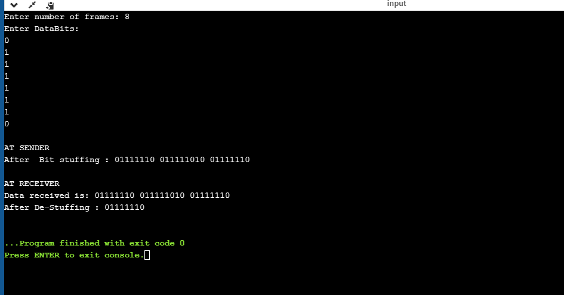

# EXPERIMENT1

## AIM: To Implement the data link layer framing methods such as:
   1.character count
   2.Bit stuffing
   3.Character stuffing

## PROCEDURE
### 1.character count
  (i)Enter the number of frames
  (ii)Print the data as frames
  (iii)Find the string length of each frame
  (iv)print the data both at sender and receiver sides
  
### 2.Bit Stuffing
  (i)Take the input as number of frames.
  (ii)Enter Databits
  (iii)Apply the bit stuffing logic at sender side and print the data.
  (iv)De-stuff the bits at the receiver side and print the data
### 3.Character stuffing
   (i)Take the input characters size based on the input size enter character data.  
   (ii)print the original data.
   (iii)Apply the character stuffing logic at the sender side and print the data.
   (iv)De=stuff the character data at the receiver side and print the data.

### output

### Bit Stuffing

### Character Stuffing

