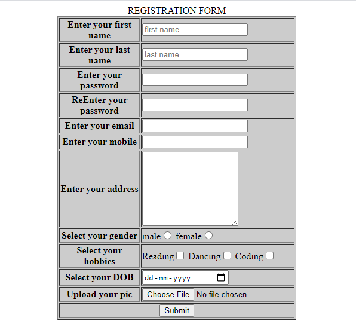

# Experiment 5

## Aim of the Experiment
To create a Registration page.

### Procedure
1.gathering the required fields to be included
2.creating the form
3.styling the page using css,html

### Output

